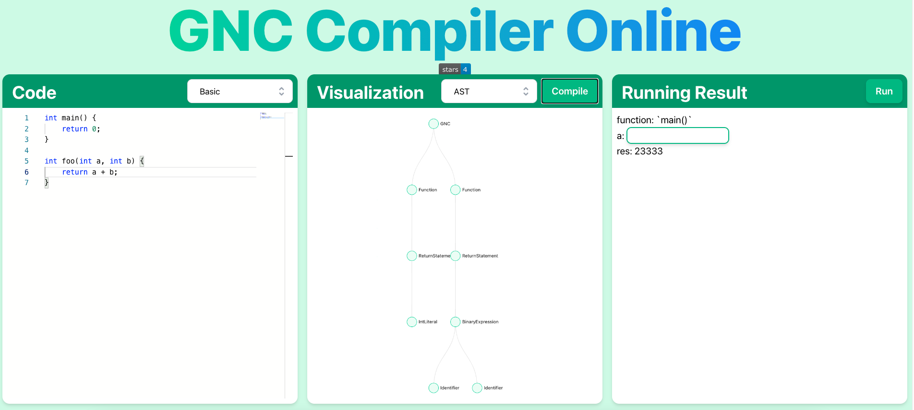

# 序言

GNC是GNC is Not C的递归表达。我们尝试构造了一种贴近C，但更加现代化的语法。它使用rust作为主体开发语言，[pest](https://pest.rs)作为parser generator，使用了LLVM作为中间表达和后端处理，并使用[inkwell](https://github.com/TheDan64/inkwell)作为LLVM与Rust的Binding。

由于使用LLVM，理论上我们可以最终编译到所有LLVM支持的汇编语言。在开发过程中，我们默认编译到x86 (amd64)、RISC-V (rv64) 和 WebAssembly (wasm64)三种汇编语言，来做最终的运行时检查。

TODO: 成果


# 项目背景

## 1. 为什么选择rust

Rust是近些年诞生的一门编译型语言。它的设计准则是“安全、并发、实用”。

Rust的作用领域是系统级编程，在这个领域有老大哥C和C++，但这两种语言碍于当时编译技术的落后和历史路径的依赖，不能完美地保证内存安全。此外，带有GC (Garbage Collection)的语言又难免需要运行时环境的支持，在GC时还难免引入不小的性能开销。

Rust通过严格的编译器检查和静态分析技术 (CFI、Lifetime、Ownership等)，使得程序员必须遵守一定的代码准则 (be explicit)，才能使得Rust代码通过编译。这样的特性显著地提高了Rust的学习成本，但也让Rust代码的开发和维护成本降到了最低。

Rust有着良好的工具链支持，包括现代化的构建工具和包管理系统 (Cargo和[crates.io](https://crates.io))、美观实用的注释文档生成框架 (Rustdoc)、强大的IDE (Clion的Rust插件)以及庞大完善的社区体系 (Reddit, Stackoverflow, [Rust Forum](https://users.rust-lang.org))。

Rust的语法特性在诸多语言中可以算是最为严谨和强大的，它在支持函数式编程、元编程和反射等诸多特性上，保证了语言的高度安全性。其他诸如动态引用、智能指针等语法糖设计地恰到好处，也让Rust这门语言看上起十分优雅。

基于以上诸多Rust的优点和兴趣的考虑，我们最终选择了Rust作为主体开发语言。

## 2. 为什么选择LLVM

LLVM是一套完整的编译器框架，它的组织化程度非常高，模块之间的交互和耦合非常恰当，因而被大量用于学术科研和工程实践当中。

LLVM-IR是LLVM内部集成的一套中间表示，是一种静态单赋值形式 (SSA)形式的IR。概括地讲，LLVM-IR有两个最为重要的特征：

- 代码被组织成三地址指令
- 有无限数量的寄存器

正因LLVM有着诸多良好的特性和优势，且能够与我们的编译器顺利地耦合 (使用inkwell作为Binding)，我们决定采用LLVM作为我们的后端框架。

## 3. 为什么是GNC而不是C

在我们编写C代码的过程中，发现过许多设计不够优雅的细节：

- 函数和全局变量都需要先声明再定义，一旦代码量大，定义和声明混杂在一起不利用阅读代码；
- C的类型系统不够严格，有许多可能因为类型错误导致的Bug；

因此我们决定设计一种非常近似于C，但在一些细节上略有不同的语法，并将这种语言命名为GNC。

## 4. 技术选型

GNC依然使用了经典的编译器架构：前端 (parser)和后端 (codegen)的设计。


前端使用了[pest](https://pest.rs)库作为parser generator。它使用的是类PEG (Parsing Expression Grammar)描述，可以按照写明的语法规则生成一个与Rust深度耦合的Parser。这个Parser将代码的输入解析成Parser Tree，再自己编写遍历Parser Tree的规则生成到AST。

后端使用了LLVM工具链，并且用[inkwell](https://github.com/TheDan64/inkwell)作为LLVM和Rust的Binding。

在Parser Tree和AST可视化上，我们为了视觉效果，选择了[AntV G6](https://g6.antv.vision/zh)可视化引擎，并且将Parse和遍历AST的过程从Rust编译到WebAssembly，部署到Github的静态前端页面上: [GNC Compiler Online](https://ziyuepan.tech/GNC/)。



<center>GNC Compiler Online: 前端展示页面</center>

此外，为了能够在静态页面能够执行GNC代码，我们还使用JavaScript实现了一个GNC的解释器。这样，GNC有了两种运行方式：Binary的编译运行和静态页面上的解释运行方式。

# 词法分析和语法分析

词法分析与语法分析都使用了类PEG描述，我们将按照语法规则自顶向下地介绍GNC的语法描述：

## 1. 顶层描述

```haskell
gnc = { SOI ~ (function | global_variable)* ~ EOI }
```

GNC的顶层规则两端匹配了程序的输入`SOI`和输出`EOI`，内部匹配了两种规则：函数声明：`function`和全局变量：`global_variable`。

## 2. 全局变量

```haskell
global_variable = { data_type ~
    (identifier ~ ("=" ~ expression)?) ~
    ("," ~ (identifier ~ ("=" ~ expression)?))* ~ ";"
}
```

全局变量的语法规则只需要考虑多变量初始化和赋值即可。

## 3. 函数

```haskell
function = { data_type ~ identifier ~ function_parameter_list ~ "{" ~ statement* ~ "}" }
function_parameter_list = { "(" ~ function_parameter? ~ ("," ~ function_parameter)*  ~ ")" }
function_parameter = { data_type ~ identifier }
```

函数包括：

- 返回类型：`data_type`
- 函数名：`identifier`
- 参数列表：`function_parameter_list`
- 函数体：`statements*`
  - _函数体是语句 (statement)的列表_

## 4. 语句


## 5. 表达式


# 语义分析

这就是语义分析？


# 优化考虑

## 使用语法规则处理优先级


## 错误流处理


## 类型系统


# 代码生成


# 测试案例

这就是测试案例？


